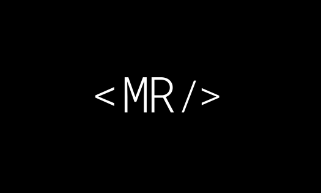

<!-- AUTO-GENERATED-CONTENT:START (STARTER) -->

  

<h1 align="center">
  Mario Rodeghiero - Front-End Developer Blog
</h1>

This blog was built with learning in the <a href="https://www.udemy.com/course/gatsby-crie-um-site-pwa-com-react-graphql-e-netlify-cms/">Willian Justen de Vasconcellos</a> course

