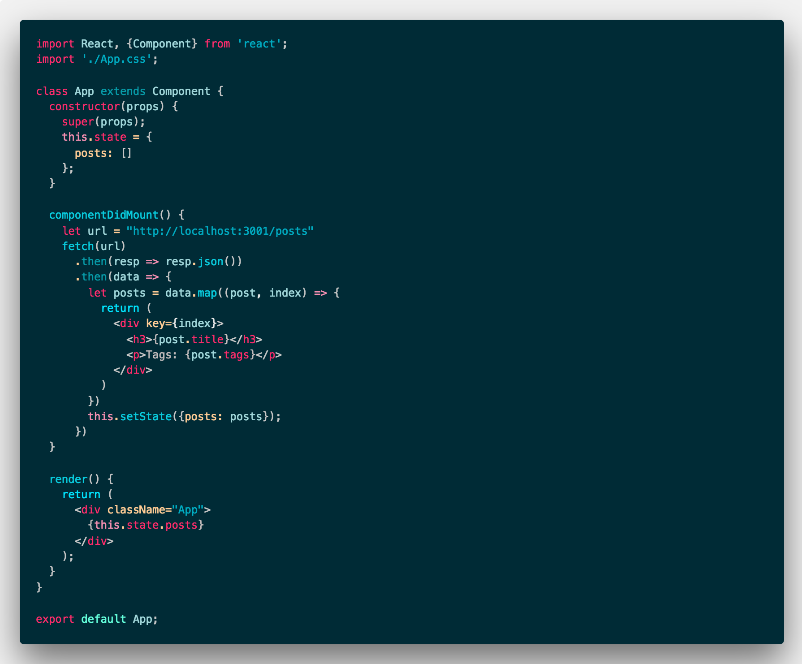
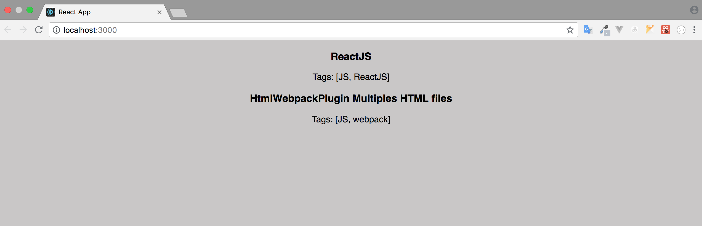

<a class="link" href="https://github.com/typicode/json-server" target="_blank">JSON Server</a> helps you to set up a REST API simply and quickly. As they report in the Github repository, you can create in less than 30 seconds. In this article, we will see how to install and make available a jSON file.</p>

## Starting the project

- We created the project using created-react-app</li>

> \$ npx create-react-app my-app</p>

> \$ cd my-app</p>

- We installed jSON-Server</li>

> \$ npm install -g json-server</p>

## Creating the JSON File

Within my-app folder we will create a file named **"db.json"** with the following data:

```js
{
    "posts": [
        {
            "title": "CopyRight Automatico",
            "tags": "[JS]"
        },
        {
            "title": "HtmlWebpackPlugin Multiples HTML files",
            "tags": "[JS, webpack]"
        }
    ]
}
```

Then let's run "json-server" and "react-app" by running the command below:

> \$ json-server --watch db.json --port 3001</p>

> \$ npm run start</p>

## Configuring the App.js file

Now that we have our "json-server" running under "localhost:3001/posts" we can do our consultation. So in the App.js file insert the following code below, where when mounting the component in the react, we perform a query with **"fetch"** and in a sequence we use the **"map"** to return each item.



## Result

Now, if we look at the "React App" page, we will have the following result.




## Conclusion

By following the steps in this article, you can create an excellent development environment with ReactJS and jSON SERVER for your applications.
The theme used in the code, I created inspired by "Vue.js" and you can install in "VS_Code", searching for <a href="https://github.com/mariorodeghiero/vue-theme-vscode">"Vue Theme"</a>.

Thanks!!!
