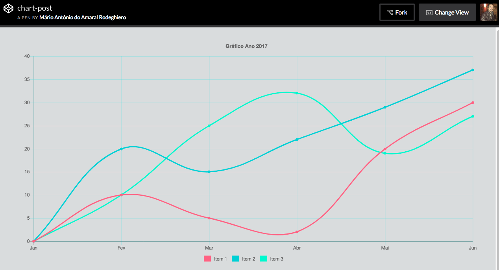

ChartJs é uma biblioteca de WebGraphics baseado em canvas, podendo realizar manipulação dos dados através de javascript, para tornar o desenvolvimento de gráficos, mais rápido e pratico. Com este framework, você ainda gera gráficos responsivos e pode personalizar de acordo com sua necessidade, pois ele possui vários tipos diferentes de gráficos.

## Código HTML

Como este é um simples exemplo para abordar apenas algumas, das varias configurações disponíveis no Chartjs, nosso código HTML vai apresentar uma tag script com um source para buscar a lib e uma simples Tag **"canvas"** com **id="myChart"**. E no final do nosso HTML, especificamos o caminho do nosso arquivo **"chart.js"**.

```html
<html>
    <head>
        <script src="https://cdnjs.xxx/Chart.min.js"/>
    </head>
    <body>

        <canvas id="myChart"></canvas>

        <script src="js/chart.js"><script>
    </body>
</html>
```

## Criando o código javascript

Primeiramente vamos adicionar um codigo meio que padrão e para dar inicio, vamos criar uma variável chamada **"ctx"** para armazenar nesta variável o elemento que possui o **id="myChart"**. Logo em seguida vamos criar uma variável chamada **myChart** e passamos a palavra **new** com nome **Chart** para criarmos um novo objeto, passando a variável **"ctx"**.

```js
var ctx = document.getElementById("myChart")

var myChart = new Chart(ctx, {})
```

Dentro do nosso código padrão, existe 3 tipos de configurações que o Chartjs nos proporciona:

## Type

Em type configuramos o tipo de gráfico que desejamos ( line, bar, radar, pie, polarArea, bubble, scatter ) em nosso exemplo vamos usar o tipo de gráfico em linha, mas você pode consultar o site do
[Chartjs](http://www.chartjs.org/) para mais informações.

```js
var ctx = document.getElementById("myChart")

var myChart = new Chart(ctx, {
  type: "line",
})
```

## Data

Em Data, nos vamos informar os dados para plotar em nosso gráfico. Primeiramente vamos informar os labels, no nosso caso vai ser apresentado alguns meses do ano, que é referenciado por um array, conforme o código abaixo. Na sequência inserimos uma vírgula e passamos os datasets para informar os dados a serem inseridos, podendo realizar algumas configurações de estilização, não entrarei em detalhes sobre estilização, pois esta disponível na documentação, mas no exemplo, já contém uma previa do que é possível estilizar.

```js
var ctx = document.getElementById("myChart")
var myChart = new Chart(ctx, {
  type: "line",
  data: {
    labels: ["Jan", "Fev", "Mar", "Abr"],
    datasets: [
      {
        label: " Item 1 ",
        borderColor: "#ff6384",
        backgroundColor: "#ff6384",
        fill: false,
        data: [0, 10, 5, 2, 20],
      },
      {
        label: " Item 2 ",
        borderColor: "#00cfd6",
        backgroundColor: "#00cfd6",
        fill: false,
        data: [0, 20, 15, 22, 29],
      },
      {
        label: " Item 3 ",
        borderColor: "#24f9cb",
        backgroundColor: "#24f9cb",
        fill: false,
        data: [0, 10, 25, 32, 19],
      },
    ],
  },
})
```

## Options

Em options, realizamos as configurações globais do nosso gráfico, então logo após o fechamento da chaves do tipo **"data"**, vamos inserir uma vírgula e passar o **"options"**. Dentro dele é possível realizar diversos tipos de configurações, vou informar e demonstrar no código abaixo, apenas algumas delas, mas também esta disponível na documentação do Chartjs.

```js
var ctx = document.getElementById("myChart")
var myChart = new Chart(ctx, {
  type: "line",
  data: {
    labels: ["Jan", "Fev", "Mar", "Abr"],
    datasets: [
      {
        label: " Item 1 ",
        borderColor: "#ff6384",
        backgroundColor: "#ff6384",
        fill: false,
        data: [0, 10, 5, 2, 20],
      },
      {
        label: " Item 2 ",
        borderColor: "#00cfd6",
        backgroundColor: "#00cfd6",
        fill: false,
        data: [0, 20, 15, 22, 29],
      },
      {
        label: " Item 3 ",
        borderColor: "#24f9cb",
        backgroundColor: "#24f9cb",
        fill: false,
        data: [0, 10, 25, 32, 19],
      },
    ],
  },
  options: {
    layout: {
      padding: {
        left: 50,
        right: 50,
        top: 20,
        bottom: 20,
      },
    },
    title: {
      display: true,
      text: "Ano 2017",
      fontSize: 13,
      padding: 20,
    },
    legend: {
      position: "bottom",
      labels: {
        boxWidth: 15,
      },
    },
    animation: {
      easing: "easeOutBack",
    },
    scales: {
      yAxes: [
        {
          gridLines: {
            display: true,
            color: "#62e0e466",
          },
        },
      ],
      xAxes: [
        {
          gridLines: {
            display: true,
            color: "#62e0e466",
          },
        },
      ],
    },
  },
})
```

## Exemplo do Código funcionando




Esse foi um post para apresentar um pouco mais sobre chartjs ♥️, esta lib open source fantástica. Agora é só colocar a criatividade em prática e brincar com as milhares de configurações possíveis no Chartjs. Caso tenha deixado passar despercebido algum erro, o código esta disponivel também no meu [codepen.io](https://codepen.io/mariorodeghiero/pen/rYoLOY).

Thanks!!
