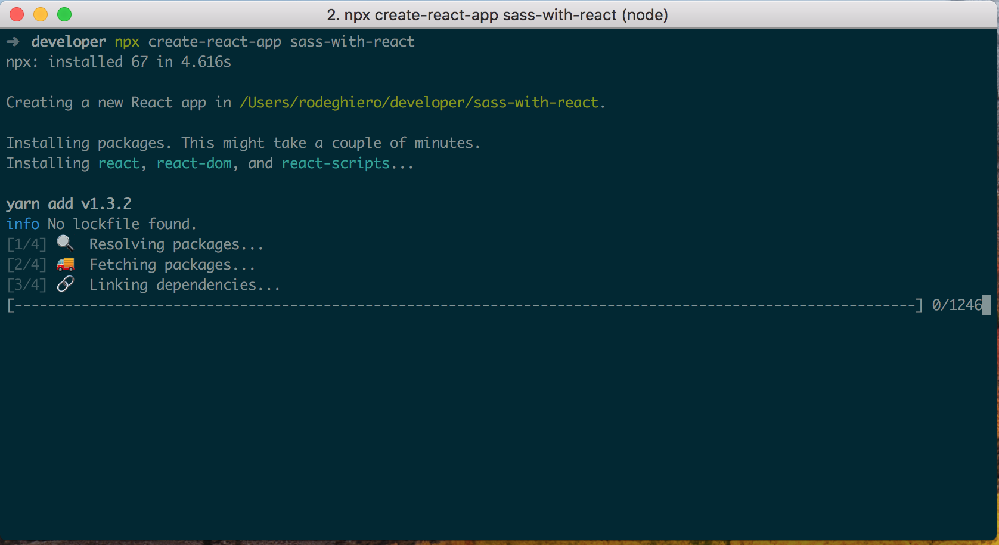

Neste artigo vou mostrar os passos para instalar e utilizar o
[Sass](https://sass-lang.com) com [React.js](https://reactjs.org). Vamos usar o
[created-react-app](https://github.com/facebook/create-react-app) como base para nosso projeto, mas antes de apresentar como iniciar um projeto com o created-react-app é necessário que você tenha instalado:

[Node.js](https://nodejs.org/en/) e [npx](https://www.npmjs.com/package/npx).

> \$ npm install -g npx

## Instalando created-react-app

Após ter os pré-requisitos instalado em seu computador, para criarmos o projeto, basta
rodar o seguinte comando abaixo, substituindo o **"nome-do-projeto"**, por o nome
desejado.

> \$ npx created-react-app nome-do-projeto



Após executar o comando, devemos entrar na pasta do projeto e executar mais alguns comandos para instalar e integrar o Sass com o react.

> \$ cd nome-do-projeto

> \$ yarn add sass-loader node-sass --dev

ou

> \$ npm install sass-loader node-sass --save-dev

## Passo 1

Agora que já instalamos os módulos necessários, devemos ejetar os arquivos de configurações do created-react-app e realizar as alterações necessárias para trabalharmos com Sass.

> \$ npm run eject

## Passo 2

Em seguida vamos editar os dois arquivos abaixo, onde estão as configurações do webpack na
pasta **"/config"**.
O primeiro é o arquivo de desenvolvimento, o segundo é o arquivo de produção.

- **Arquivo de desenvolvimento:** webpack.config.dev.js</li>
- **Arquivo de produção:** webpack.config.prod.js</li>

## Editando o arquivo de desenvolvimento

Abra o arquivo de **desenvolvimento** e depois role o scroll até localizar onde estão as configurações do **"css"**, como mostrado no código abaixo:

```js
    test: /\.css\$/,
    use: [
    require.resolve('style-loader'),
    {
        loader: require.resolve('css-loader'),
        options: {
            importLoaders: 1,
        },
    },
```

Após ter localizado, você precisa realizar as seguintes alterações abaixo. Alterando primeiramente para ler todos arquivos que terminam com **".scss"**, onde é usado uma expressão regular para indicar e depois é necessário inserir o **"sass-loader"** para realizar a transformação do arquivo original para JavaScript.

```js
    test: /\.scss\$/,
    use: [
        require.resolve('style-loader'),
    {
        loader: require.resolve('css-loader'),
        options: {
            importLoaders: 1,
        },
    },
    {
        loader: require.resolve('sass-loader')
    },
```

## Editando o arquivo de produção

Já no arquivo de **produção**, você vai encontrar a seguinte configuração abaixo:

```js
test: /\.css\$/,
loader: ExtractTextPlugin.extract(
Object.assign(
    {
        fallback: {
            loader: require.resolve('style-loader'),
            options: {
                hmr: false,
            },
        },
        use: [{
        loader: require.resolve('css-loader'),
        options: {
            importLoaders: 1,
            minimize: true,
            sourceMap: shouldUseSourceMap,
        },
    },
```

Então é só alterar, como fizemos no passo anterior, mas a única diferença é que este arquivo possui algumas configurações adicionais, como não iremos abordar sobre webpack neste artigo, você pode simplesmente subsistir o código acima, por este:

```js
    test: /\.scss\$/,
    loader: ExtractTextPlugin.extract(
    Object.assign(
    {
    fallback: {
        loader: require.resolve('style-loader'),
        options: {
            hmr: false,
        },
    },
    use: [
    {
        loader: require.resolve('css-loader'),
        options: {
            importLoaders: 1,
            minimize: true,
            sourceMap: shouldUseSourceMap,
        },
    },
    {
        loader: require.resolve('sass-loader')
    },
```

## Conclusão

Agora você pode deletar os arquivos **".css"** e criar seus arquivos **".scss"** em qualquer lugar, dentro da pasta **"src"** e estilizar suas paginas, usufruindo do poder que o [SASS](https://sass-lang.com) oferece.

**Obs:** Não esqueça de deletar os imports dos arquivos "Css" e importar os novos arquivos "Sass" para o React.js funcionar normalmente.

Thanks!!
